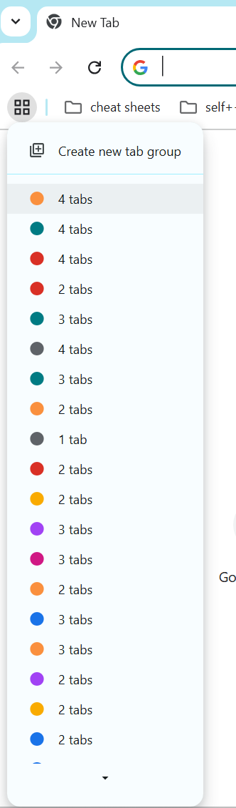
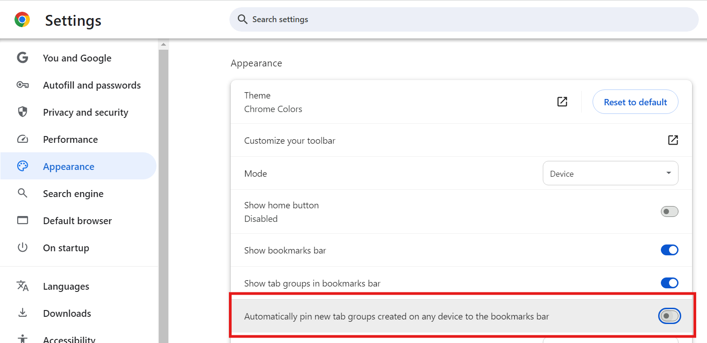
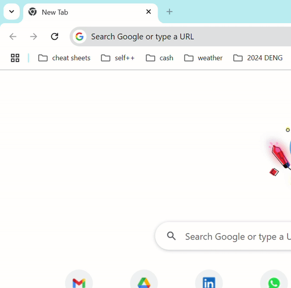

# Simple Automation tool to remove Unwanted Chrom Group Tabs

## Feature: Save Group Tabs
Sometime ago anytime you opened tabs in groups, the groups were by default saved to your Google chrome profile

[See here Chromium project list of related changes](https://chromium-review.googlesource.com/q/hashtag:%22savedtabgroups%22+(status:open+OR+status:merged))

## Side effect: Stranded group tabs 
One day I realized I had a bunch of open tabs 

## Solution: Disable auto-save 
Go to Settings | Appearance | Automatically pin new tab groups created on any device to the bookmarks bar
Disable it

## Delete all those unwanted tabs

Couldn't find a way to delete tab groups in batch or "select all" mode
According to Google Chrome's help article, you need to do it [manually](https://support.google.com/chrome/answer/2391819?hl=en#zippy=%2Cdelete-a-tab-group)

Have this simple [python script](./main.py) where you can automate the tedious clicking

TO-DO: 
- [ ] parametrize number of tab groups to be deleted
- [ ] package solution for a non python-savvy or technical user
- [ ] parametrize or have a smarter way to locate Chrome window
- [ ] create a report of open group tabs so that you can review before deleting them

